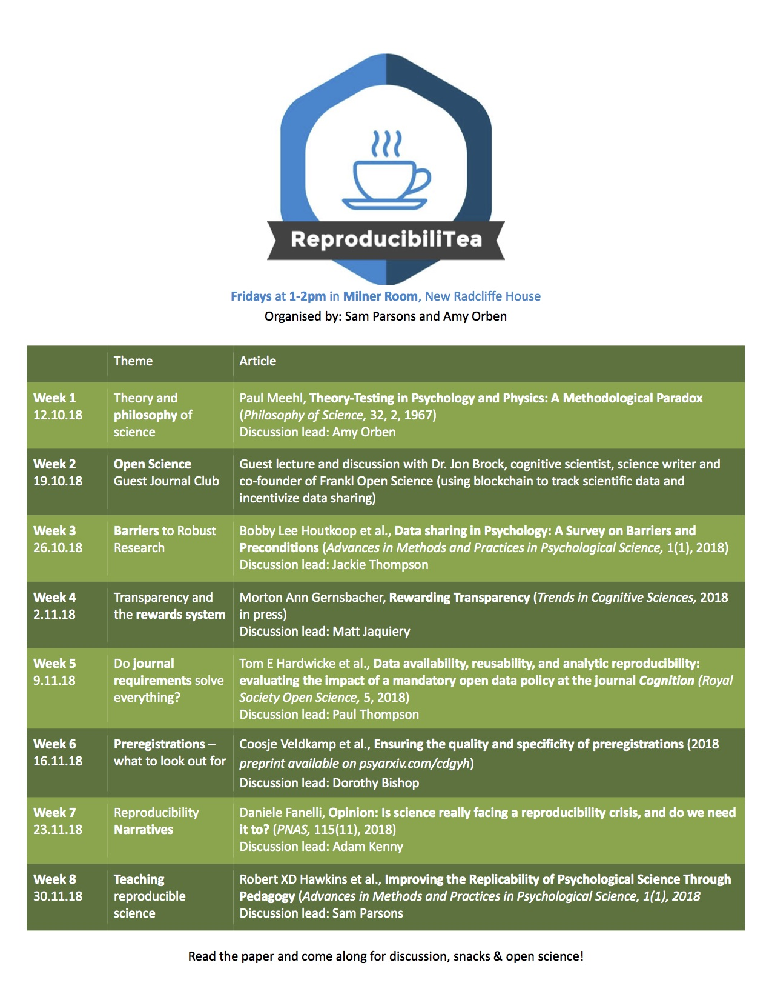

It's time for more Reproducibility Events at Oxford this term!
There will be two weekly events relating to reproducibility and open
research, on Wednesday afternoon and Friday lunch time.

Back after a successful run in Trinity Term 2018 is the <a
href="https://twitter.com/reproducibilit"
target="_blank">ReproducibiliTea</a> journal club, organized by Sam
Parsons and Amy Orben in the <a
href="https://www.psy.ox.ac.uk/" target="_blank">Department of
Experimental Psychology</a>. This term they'll be meeting Fridays
13:00--14:00 in the Milner Room, New Radcliffe House. Come along for
discussion, snacks, and open science!

Also back is the <a
href="http://users.ox.ac.uk/~phys1213/ReproAtASC.html"
target="_blank">Seminar on Reproducibility and Open Research</a>,
organized by Lisa Lodwick and Jasmine Nirody at <a
href="https://www.asc.ox.ac.uk/" target="_blank">All Souls
College</a>, Wednesdays 16:30--18:00.

 

As for our regular activities, we are planning a <a
href="https://software-carpentry.org/" target="_blank">Software
Carpentry</a> workshop for next term --- as usual, check our <a href="../events">events</a> page,
subscribe to our
[mailing list](https://web.maillist.ox.ac.uk/ox/info/rroxford), and
follow us on Twitter [@RR_Oxford](https://twitter.com/RR_Oxford) for
announcements!
